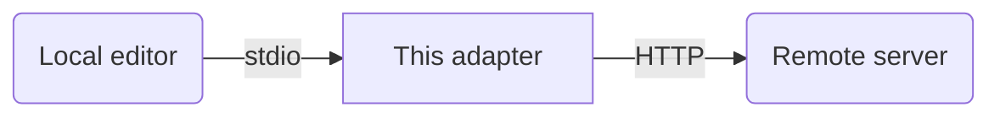

# MCP stdio adapter

Simple proxy that allows you to expose a remote MCP servers (streamable HTTP) as a local stdio MCP server. Useful for using remote MCP servers in applications that only support stdio (such as Zed).



## Usage

### From the command line

You can run the proxy as follows:

```
SERVER_ADDRESS=http://<address-of-your-mcp-server> uv run fastmcp run main.py
```

or using Docker:

```
docker run --rm -it -e SERVER_ADDRESS=http://<your-server-address> jrderuiter/mcp-stdio-adapter
```

### In Zed

For Zed, you can configure the proxy by adding the following `context_servers` entry in your settings file:

```json
  "context_servers": {
    "<name-of-your-server>": {
      "command": {
        "path": "uv",
        "args": [
          "run",
          "--project",
          "<local-path-to-this-repo>",
          "fastmcp",
          "run",
          "<local-path-to-this-repo>/main.py"
        ],
        "env": {
          "SERVER_ADDRESS": "http://<address-of-your-server>"
        }
      }
    }
```

or using Docker:

```json
  "context_servers": {
    "<name-of-your-server>": {
      "command": {
        "path": "docker",
        "args": [
          "run",
          "--rm",
          "-it",
          "-e",
          "SERVER_ADDRESS",
          "jrderuiter/mcp-stdio-adapter",
        ],
        "env": {
          "SERVER_ADDRESS": "http://<address-of-your-server>"
        }
      }
    }
```
